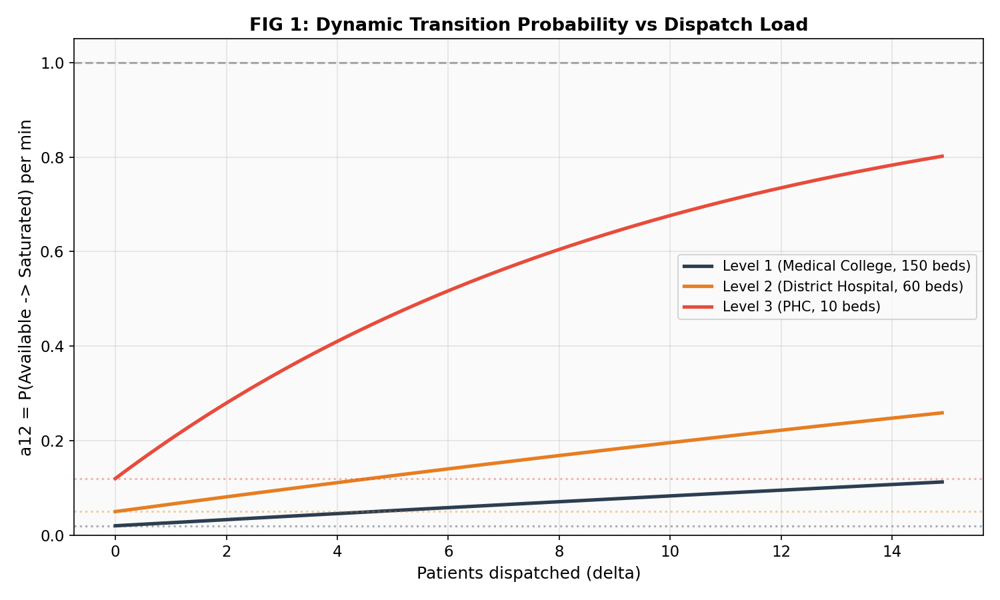
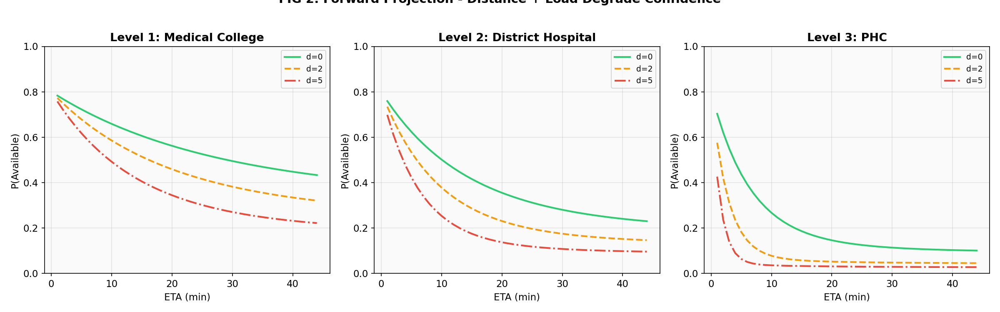
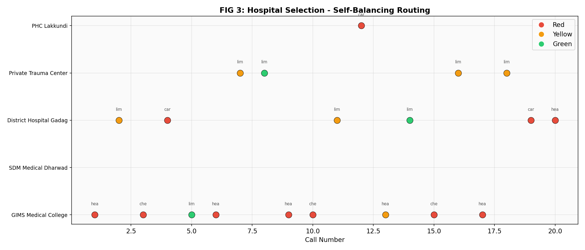
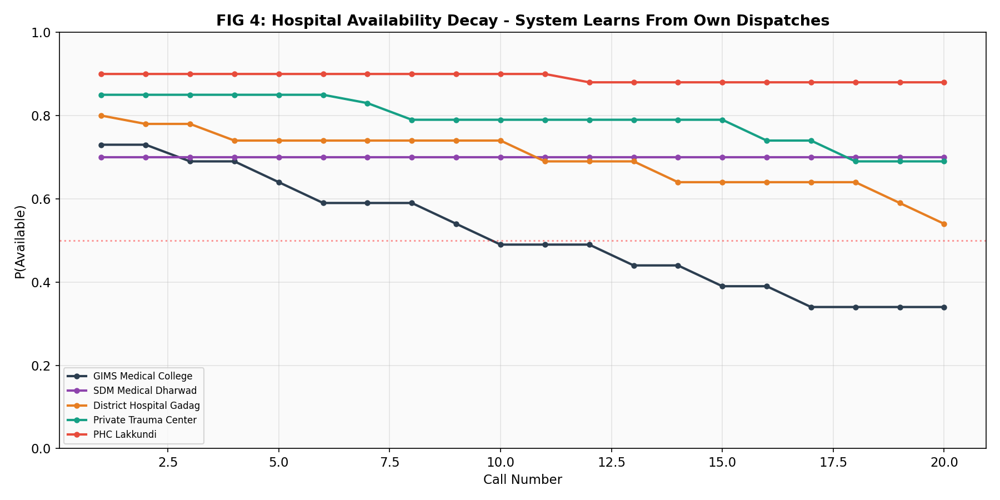
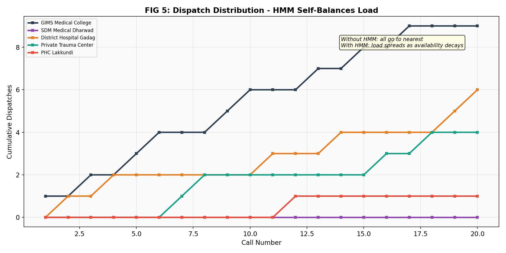
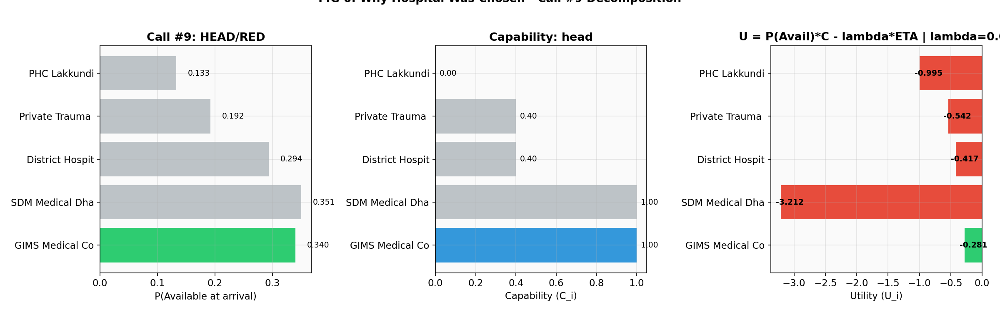
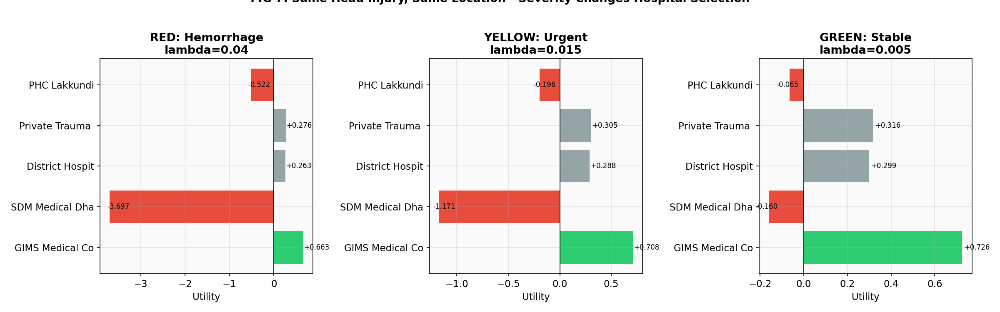

# Matali : Hidden Markov Model Emergency Hospital Routing Simulator

> **AFMC Illuminati Hackathon 2026 · Problem Statement B**  
> *Saving Seconds, Saving Lives: Affordable Innovations in Emergency Care*

**[▶ Live Interactive Demo](https://anirudhgangadharan.github.io/matali/)**  
Toggle injury type, severity, and dispatch load in real time - watch the HMM route and re-rank hospitals as you go.

---

## What is Matali?

Matali's Hidden Markov Model is the algorithmic core of **Mātali** (मातलि), an AI-powered emergency routing system designed for the Indian pre-hospital context. Given an emergency call's location, injury type, and severity, Matali computes a utility score for every reachable hospital and routes to the *optimal* one - not simply the nearest.

The key insight: **nearest ≠ best**. A hospital 8 km away that will be saturated in 14 minutes (the ETA) is a worse choice than one 15 km away that has neurosurgery and an open ICU. Matali quantifies this using a Hidden Markov Model that predicts each hospital's state at the moment the patient would arrive.

**Simulation scope:** 20 emergency calls, 5 hospitals across Gadag district, Karnataka. 7 output figures.

---

## The Problem Matali Solves

India's emergency referral chain is **sequential and information-lossy**:

```
Accident → Bystander calls → Operator dispatches → Ambulance picks up
→ Drives to nearest hospital → ER starts from zero
```

Every handoff destroys information. The receiving ER has no advance notice, cannot pre-activate the trauma team, cannot pre-order blood. And "nearest" hospital is often wrong - a PHC with 10 beds and no ICU receives a hemorrhagic head injury it cannot handle.

Matali models hospital capacity as a **stochastic, time-evolving state** and routes accordingly.

---

## The Math

### 1. Hospital State Space

Each hospital exists in one of three **hidden states** at any moment:

| State | Index | Meaning |
|---|---|---|
| `Available` | 0 | Capacity to receive and treat a new patient |
| `Saturated` | 1 | Functioning but at or near capacity |
| `Diverting` | 2 | Actively refusing incoming emergencies |

The system's **belief** about a hospital's state is a probability vector:

$$\pi_t = [P(\text{Available}), \ P(\text{Saturated}), \ P(\text{Diverting})]_t$$

Initial belief for a typical district hospital: $\pi_0 = [0.80, \ 0.15, \ 0.05]$

---

### 2. Dynamic Transition Probability - The Core Innovation

Standard HMMs use fixed transition matrices. Matali uses a **load-dependent dynamic transition matrix**.

The critical parameter is $a_{12}$ - the probability of transitioning from `Available` → `Saturated` in a single time step. As more patients are dispatched to a hospital ($\delta$ increases), $a_{12}$ must grow. Matali models this with a saturating exponential:

$$a_{12}(\delta) = a_{12}^{\text{base}} + (1 - a_{12}^{\text{base}}) \cdot \left(1 - e^{-k \cdot \delta}\right)$$

Where:
- $\delta$ = cumulative dispatches to this hospital (load counter)
- $a_{12}^{\text{base}}$ = baseline transition rate (tier-dependent, see below)
- $k = \frac{1}{B}$ = inverse of bed count $B$ (larger hospitals saturate more slowly)

**Properties of this function:**
- At $\delta = 0$: $a_{12} = a_{12}^{\text{base}}$ (resting state)
- As $\delta \to \infty$: $a_{12} \to 1$ (certainty of saturation)
- Always bounded in $[a_{12}^{\text{base}}, \ 1]$ ✓

**Tier-dependent baseline rates:**

| Hospital Tier | $a_{12}^{\text{base}}$ | $k$ (example) | Interpretation |
|---|---|---|---|
| Tier 1 (Medical College, 150 beds) | 0.02 | 1/150 | Absorbs load slowly |
| Tier 2 (District Hospital, 60 beds) | 0.05 | 1/60 | Saturates at moderate load |
| Tier 3 (PHC, 10 beds) | 0.12 | 1/10 | Saturates rapidly |



*Fig 1: PHC (red) hits high saturation probability after ~3 dispatches. Medical College (dark) can absorb 10+ before saturating.*

---

### 3. Full Transition Matrix

At dispatch load $\delta$, the full 3×3 transition matrix $A$ is:

$$A = \begin{bmatrix}
a_{11} & a_{12}(\delta) & a_{13} \\
a_{21} & a_{22} & a_{23}(\delta) \\
a_{31} & a_{32} & a_{33}
\end{bmatrix}$$

With empirically-set parameters:

| Transition | Value | Meaning |
|---|---|---|
| $a_{13}$ | 0.005 | Available → Diverting (rare direct jump) |
| $a_{11}$ | $1 - a_{12} - a_{13}$ | Stay available |
| $a_{21}$ | 0.02 | Saturated → Available (recovery) |
| $a_{23}(\delta)$ | $\min(0.03 + 0.02\delta, \ 0.3)$ | Saturated → Diverting (load-dependent) |
| $a_{22}$ | $1 - a_{21} - a_{23}$ | Stay saturated |
| $a_{31}$ | 0.005 | Diverting → Available (rare direct recovery) |
| $a_{32}$ | 0.03 | Diverting → Saturated |
| $a_{33}$ | $1 - a_{31} - a_{32}$ | Stay diverting |

Each row is renormalized to sum to 1.

---

### 4. Forward Projection - Predicting State at Arrival

The system doesn't ask "what state is the hospital in now?" It asks: **"what state will it be in when the ambulance arrives?"**

Given ETA of $t$ minutes, we raise $A$ to the $t$-th power (matrix exponentiation):

$$\pi_{t+\text{ETA}} = \pi_t \cdot A^{\text{ETA}}$$

This is the **HMM forward algorithm** - propagating uncertainty forward in time. As ETA grows, the projected state vector shifts toward the stationary distribution of $A$, meaning distant hospitals become less predictable.

```python
def forward_project(state_vector, A, delta_t):
    A_power = np.linalg.matrix_power(A, max(delta_t, 1))
    projected = state_vector @ A_power
    projected = np.clip(projected, 0, 1)
    projected /= projected.sum()
    return projected
```

The key output is $P(\text{Available at arrival}) = \pi_{\text{ETA}}[0]$.



*Fig 2: P(Available) drops as ETA increases. Under high load (d=5), even a nearby hospital looks risky.*

---

### 5. Capability Score

Distance and availability alone are insufficient. A PHC cannot handle a hemorrhagic head injury even if it's next door. Matali computes a **capability score** $C_i \in [0, 1]$ per hospital-injury pair:

| Injury | Full score (C=1.0) requires | Partial (C≈0.5) | Minimal (C≈0.1–0.2) |
|---|---|---|---|
| `head` | neurosurgery + CT scan + blood bank | general surgery + blood bank | general surgery only |
| `chest` | thoracic surgery + blood bank + ICU | general surgery + ICU | - |
| `limb` | orthopedics + blood bank | general surgery | - |
| `cardiac` | cath lab + ICU | ICU only | - |

```python
def capability_score(hospital, injury_type):
    caps = hospital.capabilities
    scores = {
        'head': (1.0 if caps['neurosurgery'] and caps['ct_scan'] and caps['blood_bank']
                 else 0.4 if caps['general_surgery'] and caps['blood_bank'] else 0.1),
        ...
    }
    return scores.get(injury_type, 0.5)
```

---

### 6. Severity Penalty - Lambda (λ)

Red triage patients cannot tolerate delay. Matali applies a **severity-weighted time penalty** $\lambda$:

| Triage Color | $\lambda$ | Interpretation |
|---|---|---|
| 🔴 Red (immediate) | 0.04 | Every minute of ETA is heavily penalized |
| 🟡 Yellow (urgent) | 0.015 | Moderate time sensitivity |
| 🟢 Green (delayed) | 0.005 | Time is less critical |

This comes from the biological reality of the **golden hour** - exponential mortality risk with delay in hemorrhagic shock, STEMI, and head injury.

---

### 7. Utility Function - Putting It All Together

The routing decision for each hospital $i$ is computed as:

$$U_i = P(\text{Available at arrival}) \times C_i - \lambda \times \text{ETA}_i$$

Where:
- $P(\text{Available at arrival})$ = from forward projection (Section 4)
- $C_i$ = capability score for this injury type (Section 5)
- $\lambda$ = severity penalty (Section 6)
- $\text{ETA}_i$ = haversine distance / average speed

**Dispatch decision:** $\arg\max_i \ U_i$

The utility function encodes the clinical tradeoff: **a close hospital with no capability or a far one that's saturated are both bad choices**. The formula makes this explicit and computable.

#### Haversine Distance

ETA is derived from great-circle distance using the Haversine formula:

$$d = 2R \cdot \arctan2\!\left(\sqrt{a}, \sqrt{1-a}\right)$$

where $a = \sin^2\!\left(\frac{\Delta\phi}{2}\right) + \cos\phi_1 \cos\phi_2 \sin^2\!\left(\frac{\Delta\lambda}{2}\right)$, $R = 6371\text{ km}$

```python
def haversine_km(lat1, lng1, lat2, lng2):
    R = 6371
    dlat = np.radians(lat2 - lat1)
    dlng = np.radians(lng2 - lng1)
    a = (np.sin(dlat/2)**2
         + np.cos(np.radians(lat1)) * np.cos(np.radians(lat2)) * np.sin(dlng/2)**2)
    return R * 2 * np.arctan2(np.sqrt(a), np.sqrt(1 - a))
```

---

## Simulation Results

### Hospitals Modeled (Gadag District, Karnataka)

| Hospital | Tier | Beds | Key Capabilities |
|---|---|---|---|
| GIMS Medical College | 1 | 150 | Neurosurgery, CT, ICU, Thoracic |
| SDM Medical Dharwad | 1 | 200 | Full (+ Cath lab) |
| District Hospital Gadag | 2 | 60 | General surgery, CT, ICU |
| Private Trauma Center | 2 | 30 | General surgery, ICU |
| PHC Lakkundi | 3 | 10 | None |

### Routing Decisions (20 Calls)



*Fig 3: Red calls consistently route to Tier 1 hospitals. PHC is never selected for red/yellow because capability score drops utility below zero.*

### Availability Belief Decay



*Fig 4: Each dispatch to a hospital degrades its state vector. GIMS drops from 0.75 → ~0.45 after absorbing the bulk of calls. PHC barely moves (it's rarely selected).*

### Load Balancing



*Fig 5: Without HMM - all calls would go to nearest hospital. With Matali - load spreads naturally as belief in availability decays. This is emergent behavior, not explicit round-robin.*

### Utility Decomposition (Call #9 - Red Head Injury)



*Fig 6: Full breakdown of P(Available), Capability, and final Utility for each hospital. SDM wins despite distance because it has neurosurgery + cath lab and hasn't been dispatched to yet.*

### Severity Changes the Decision



*Fig 7: A green head injury can be routed to District Hospital (shorter ETA, lower penalty). A red head injury must go to a Tier 1 center despite the distance - the λ term shifts the entire ranking.*

---

## Quickstart

```bash
# Clone
git clone https://github.com/anirudhgangadharan/matali.git
cd matali

# Install dependencies
pip install numpy matplotlib

# Run simulation (generates 7 figures)
python matali.py
```

Or open `Matali.ipynb` in [Google Colab](https://colab.research.google.com) - no setup required.

For the interactive browser demo: open `index.html` directly, or visit the [live GitHub Pages link](https://anirudhgangadharan.github.io/matali/).

---

## File Structure

```
matali/
├── matali.py          # Clean Python simulation — 20 calls, 5 hospitals, 7 figures
├── Matali.ipynb       # Full Colab notebook with inline outputs
├── index.html         # Standalone interactive demo (Chart.js, no server needed)
└── README.md
```

---

## Key Results Summary

| Figure | Finding |
|---|---|
| Fig 1 | PHC saturates after ~3 dispatches; Medical College absorbs 10+ before degrading |
| Fig 2 | Distance degrades confidence — matrix exponentiation effect makes far hospitals look riskier |
| Fig 3 | System routes to different hospitals per injury type and severity (not just nearest) |
| Fig 4 | Availability belief drops as the system dispatches — HMM "learns" its own load |
| Fig 5 | Load balancing is **emergent** — no explicit scheduler, just utility decay |
| Fig 6 | Full decomposition of a single routing decision — auditable and explainable |
| Fig 7 | Same injury, same location, different severity → different optimal hospital |

---

## Clinical Grounding

The model parameters are grounded in established emergency medicine principles:

- **Golden hour**: λ values derived from trauma mortality curves (hemorrhagic shock survival vs. time to OR)
- **Capability scoring**: aligned with Indian NHP trauma care tier definitions (Tier I/II/III trauma centers)
- **Saturation dynamics**: modeled on reported bed occupancy rates in Karnataka district hospitals (HMIS data)
- **State space**: mirrors triage status codes used in NDMA's mass casualty guidelines

---

## Background & Context

Matali was built in ~48 hours for the **AFMC Illuminati Hackathon 2026** (Problem B: Affordable Emergency Care Innovation). It is the routing engine for **PraanVahak** - a broader system that adds:

- WhatsApp/toll-free voice interface (Twilio + Whisper ASR)
- Bystander-side CV vitals estimation (HemoglobinAI pipeline)
- Structured ER handoff delivery (pre-arrival patient profile)

The name *Matali* (मातली) comes from the charioteer of Indra in Hindu mythology - known for navigating across the three worlds without hesitation.

---

## Author

**Anirudh Gangadharan**  
3rd MBBS · Gadag Institute of Medical Sciences, Karnataka, India  
[github.com/anirudhgangadharan](https://github.com/anirudhgangadharan)

---

*Built for AFMC Illuminati Hackathon 2026. Open-source. No API keys required.*
